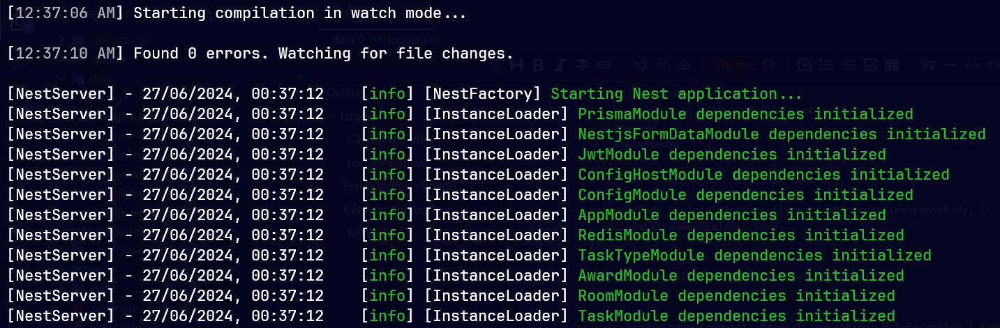
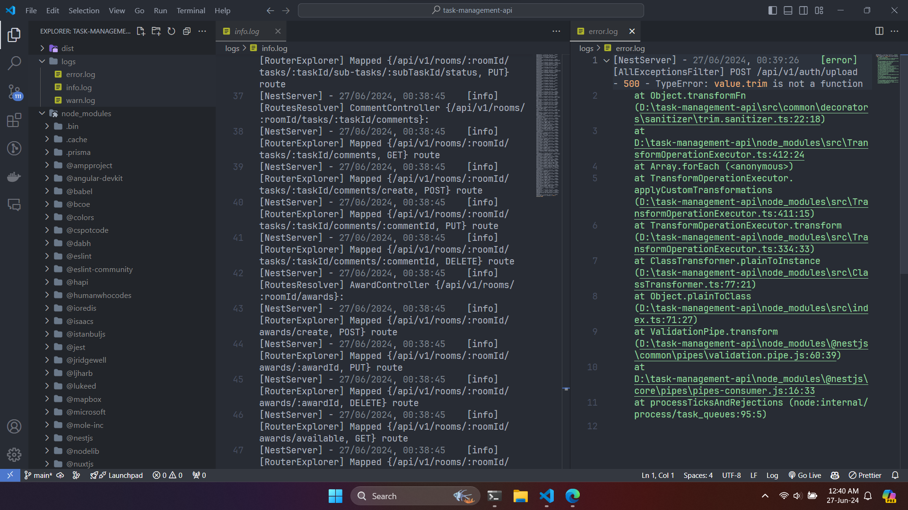

# Logger

:::info

- Logger là một công cụ được sử dụng để ghi lại các thông báo log nhằm hỗ trợ việc theo dõi và gỡ lỗi ứng dụng.
- Ta sẽ sử dụng Winston để thực hiện việc ghi log trong NestJS.
- Có 7 cấp độ log:
  - **error: 0**
  - **warn: 1**
  - **info: 2**
  - **http: 3**
  - **verbose: 4**
  - **debug: 5**
  - **silly: 6**

:::

## Cài đặt thư viện

```bash
npm install winston nest-winston
```

## Logger options

- Có 3 options trong cấu hình logger mà ta sẽ hay dùng:

| Options    | Mô tả                                                                                                                                                                                                                                                                                                                                         |
| ---------- | ----------------------------------------------------------------------------------------------------------------------------------------------------------------------------------------------------------------------------------------------------------------------------------------------------------------------------------------------- |
| level      | - Chỉ định mức độ ưu tiên của các thông báo log. Chỉ những thông báo log có mức độ bằng hoặc cao hơn mức độ này mới được ghi lại. Chỉ nhận 1 trong 7 giá trị như ở bên trên đã giới thiệu.<br />- Ví dụ: `level: 'info'` sẽ ghi lại các thông báo từ `info`, `warn`, và `error`. |
| format     | - Chỉ định định dạng của các thông báo log trước khi chúng được ghi lại.<br />- Winston cung cấp nhiều định dạng có sẵn như `json`, `simple`, `timestamp`, và `printf`.<br />- Các định dạng có thể được kết hợp lại với nhau bằng cách sử dụng `combine`.                                 |
| transports | - Xác định nơi các thông báo log sẽ được ghi lại, ví dụ như file, console, HTTP, hay bất kỳ đích đến nào khác.<br />- Một logger có thể có nhiều `transports`, và mỗi `transport` có thể có cấu hình riêng.                                                                                            |

- Ví dụ về 1 logger options:

```ts
const loggerOptions: LoggerOptions = {
  level: "silly",
  format: format.combine(
    format.colorize({ all: true }),
    format.json(),
    format.timestamp({ format: "DD/MM/YYYY, HH:mm:ss    " }),
    format.label({ label: "NestServer" }),
    format.printf((info) => {
      //Cấu hình format message được ghi ra
      const { label, timestamp, level, context, message, ...args } = info;
      return `[${label}] - ${timestamp}[${level}] [${context}] ${message}`;
    })
  ),
  transports: [
    new transports.Console(),
    new transports.File({
      filename: "logs/warn.log",
      level: "warn",
      format: getProductionLoggerFormat("warn"),
    }),
  ],
};
```

:::note

- `level` và `format` trong options sẽ áp dụng cho tất cả các `transports` mà ta khai báo
- Trong mỗi transport, ta có thể cấu hình lại `level`, thêm các `format` mới (format được cấu hình chung vẫn sẽ được áp dụng).

:::

## Setup logger cho môi trường development và production

- Sau đây, ta sẽ tạo cấu hình logger cho 2 môi trường là development và production.
  - Ở môi trường development, chỉ cần log ra ở console.
  - Ở môi trường production, thực tế ta sẽ phải sử dụng một số dịch vụ hỗ trợ log ở cloud như AWS, Azure. Nhưng ở đây, ta chỉ đơn thuần là ghi log ra file kết hợp in ra ở console.
  - Như đã nói ở trên, vì theo từng level, chỉ những thông báo log có level bằng hoặc cao hơn level hiện tại sẽ được ghi lại. Ví dụ: `level: "info"` thì sẽ ghi lại cả `error` lẫn `warn`, cho nên ta phải cấu hình lại sao cho level nào thì chỉ ghi log ở level đó thông qua hàm `getProductionLoggerFormat()`. Nếu **error** thì chỉ ghi ra **error.log**, tương tự với **info**, **warn**. Các file này sẽ lưu ở thư mục **logs** (thư mục này nằm ở cấp độ ngoài cùng của app, hay nó nằm cùng cấp với file **package.json**)
- Tạo file tên **logger.config.ts**:

```ts
import { createLogger, format, LoggerOptions, transports } from "winston";

const defaultFormat = format.combine(
  format.json(),
  format.timestamp({ format: "DD/MM/YYYY, HH:mm:ss    " }),
  format.label({ label: "NestServer" }),
  format.printf((info) => {
    const { label, timestamp, level, context, message, ...args } = info;
    return `[${label}] - ${timestamp}[${level}] [${context}] ${message}`;
  })
);

export const developmentLoggerOptions: LoggerOptions = {
  level: "silly",
  format: format.combine(format.colorize({ all: true }), defaultFormat),
  transports: [new transports.Console()],
};

// Chỉ ghi lại log theo level tương ứng
const getProductionLoggerFormat = (level: string) => {
  return format.combine(
    format((info) => {
      if (info.level !== level) {
        return false;
      }
      return info;
    })()
  );
};

export const productionLoggerOptions: LoggerOptions = {
  level: "info",
  format: defaultFormat,
  transports: [
    new transports.Console(),
    new transports.File({
      filename: "logs/error.log",
      format: getProductionLoggerFormat("error"),
    }),
    new transports.File({
      filename: "logs/info.log",
      format: getProductionLoggerFormat("info"),
    }),
    new transports.File({
      filename: "logs/warn.log",
      format: getProductionLoggerFormat("warn"),
    }),
  ],
};

const loggerOptions =
  process.env.NODE_ENV === "development"
    ? developmentLoggerOptions
    : productionLoggerOptions;

export const winstonLogger = createLogger(loggerOptions);
```

- Ở file **main.ts**:

```ts
import { NestFactory } from "@nestjs/core";
import { WinstonModule } from "nest-winston";

import { AppModule } from "./app.module";
import { winstonLogger } from "src/common/logger/logger.config";

async function bootstrap() {
  const app = await NestFactory.create(AppModule, {
    logger: WinstonModule.createLogger({ instance: winstonLogger }), // Add custom logger
  });

  await app.listen(8080);
}
bootstrap();
```

- Cuối cùng, thêm `Logger` vào mảng các **providers** trong file **app.module.ts**:

```ts
import { Logger, Module } from "@nestjs/common";

@Module({
  imports: [],
  controllers: [],
  providers: [
    Logger, //Add this
  ],
})
export class AppModule {}
```

- Giờ ta có thể ghi log như sau:

```ts
import {
  BadRequestException,
  Inject,
  Injectable,
  Logger,
} from "@nestjs/common";

@Injectable()
export class AuthService {
  private readonly logger = new Logger(AuthService.name); // Đảm bảo có dòng này để giá trị của "context" không bị "undefined"

  signup = async () => {
    this.logger.log("Register successfully");
  };
}
```

## Kết hợp ghi log trong exception filter

- Ở lần trước, ta đã tạo một exception filter để catch tất cả các exception được throw ra trong app, giờ ta sẽ kết hợp ghi log (chỉ đối với những lỗi có **statusCode** là **500**):

```ts
import {
  ArgumentsHost,
  Catch,
  ExceptionFilter,
  HttpException,
  HttpStatus,
  Logger
} from '@nestjs/common';
import { plainToInstance } from 'class-transformer';
import { Request, Response } from 'express';

import { ExceptionResponse } from 'src/common/dto/ExceptionResponse.dto';

@Catch()
export class AllExceptionsFilter implements ExceptionFilter {
  private readonly logger = new Logger(AllExceptionsFilter.name);

  catch(exception: HttpException | Error, host: ArgumentsHost): void {
    const ctx = host.switchToHttp();
    const response = ctx.getResponse<Response>();
    const request = ctx.getRequest<Request>();

    this.handleResponse(request, response, exception);
    this.handleLogger(request, exception);
  }

  private handleResponse(
    request: Request,
    response: Response,
    exception: HttpException | Error
  ): void {
    let statusCode: number = HttpStatus.INTERNAL_SERVER_ERROR;
    let message: string = 'Internal server error';
    let responseBody: any = {
      statusCode,
      message,
      path: request.url
    };

    if (exception instanceof HttpException) {
      statusCode = exception.getStatus();
      if (statusCode !== HttpStatus.INTERNAL_SERVER_ERROR) {
        const exceptionResponseMessage: string | string[] | undefined = (
          exception.getResponse() as any
        )?.message;
        message = Array.isArray(exceptionResponseMessage)
          ? exceptionResponseMessage.join(', ')
          : exceptionResponseMessage || 'Unknown error message';

        responseBody = {
          ...responseBody,
          ...(exception.getResponse() as object),
          message,
          statusCode
        };
      }
    }

    responseBody = plainToInstance(ExceptionResponse, responseBody, {
      excludeExtraneousValues: true
    });

    response.status(statusCode).json(responseBody);
  }

  private handleLogger(request: Request, exception: HttpException | Error) {
    const statusCode =
      exception instanceof HttpException
        ? exception.getStatus()
        : HttpStatus.INTERNAL_SERVER_ERROR;

    if (statusCode === HttpStatus.INTERNAL_SERVER_ERROR) {
      this.logger.error(
        `${request.method} ${request.url} - ${statusCode} - ${exception.stack?.toString()}`
      );
    }
  }
}

```

## Kết quả

- Ở môi trường **development**:



- Ở môi trường **production** (ghi log ra file):


