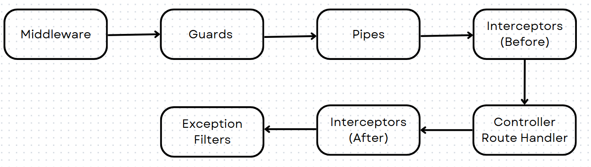

# Luồng hoạt động

1. **Middleware** : Nhận và xử lý yêu cầu HTTP ban đầu.
2. **Guards** : Kiểm tra quyền truy cập và bảo mật.
3. **Pipes** : Biến đổi và xác thực dữ liệu của yêu cầu.
4. **Interceptors (Before)** : Thực hiện các thao tác trước khi controller hoặc route handler xử lý yêu cầu.
5. **Controller/Route Handler** : Xử lý chính của yêu cầu.
6. **Interceptors (After)** : Thực hiện các thao tác sau khi controller hoặc route handler xử lý xong.
7. **Exception Filters** : Xử lý ngoại lệ nếu có phát sinh trong quá trình xử lý yêu cầu.

