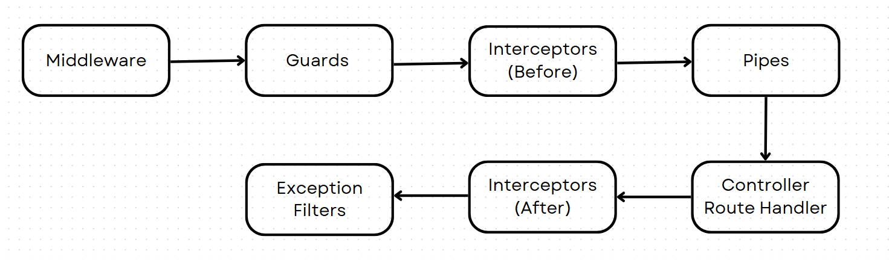
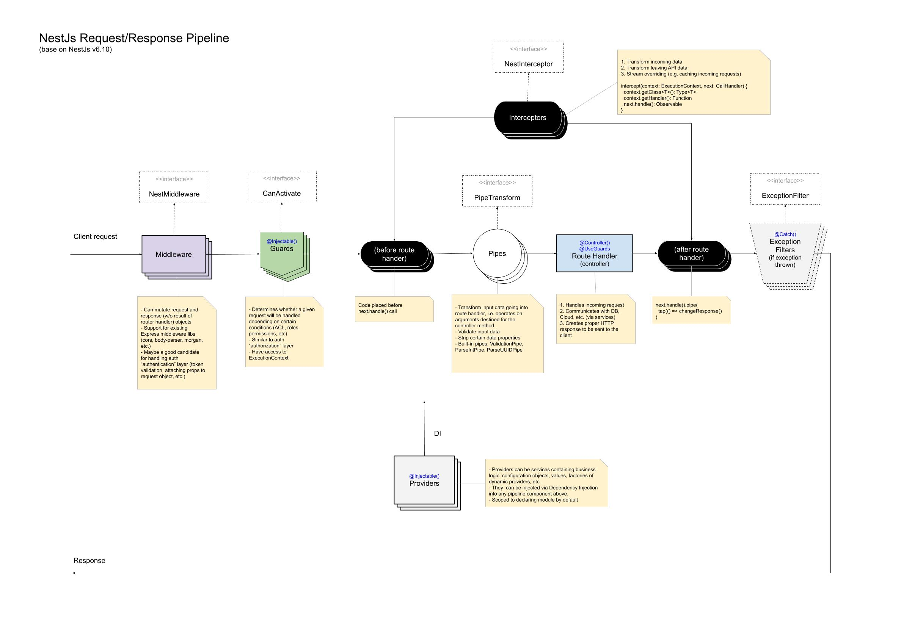

# Luồng hoạt động

1. **Middleware** : Xử lý các yêu cầu trước khi chúng đến **Guards**, **Interceptors**, **Pipes**, và **Controllers** , có thể truy cập vào object Request để thay đổi dữ liệu.
2. **Guards** : Bảo vệ và kiểm soát quyền truy cập vào các route. Xác định người dùng có được phép thực hiện yêu cầu không (thường là dựa trên roles hoặc permissions).
3. **Interceptors (Before)** : Thực hiện các hành động trước khi yêu cầu được xử lý bởi **Controller** . Có thể sửa đổi yêu cầu hoặc thêm logic như caching hay log thời gian.
4. **Pipes** : Chuyển đổi và xác thực dữ liệu. Pipes có thể biến đổi hoặc kiểm tra dữ liệu đầu vào trước khi nó được xử lý bởi **Controller**.
5. **Controller/Route Handler** : Xử lý yêu cầu HTTP và trả về phản hồi. Đây là phần cốt lõi xử lý logic nghiệp vụ của ứng dụng.
6. **Interceptors (After)** : Thực hiện các hành động sau khi **Controller** xử lý yêu cầu nhưng trước khi phản hồi được gửi lại cho client. Interceptor này thường dùng để thay đổi dữ liệu phản hồi hoặc log kết quả.
7. **Exception Filters** : Bắt và xử lý các ngoại lệ (errors) phát sinh trong quá trình xử lý yêu cầu. Thay vì để lỗi làm sập ứng dụng, các **Exception Filters** giúp trả về thông điệp lỗi có định dạng dễ hiểu cho người dùng.

