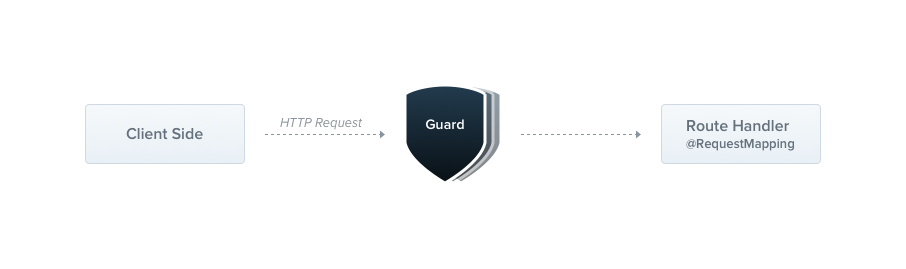

# Guards

## Guard là gì?

Guard trong NestJS là một tính năng quan trọng được sử dụng để xác thực và ủy quyền truy cập vào các endpoint trong ứng dụng. Chúng đảm nhiệm các chức năng sau:

1. **Xác thực (Authentication)** : Guard giúp xác định danh tính của người dùng, đảm bảo rằng chỉ những người dùng được ủy quyền mới có thể truy cập vào các endpoint nhất định.
2. **Ủy quyền (Authorization)** : Guard kiểm tra vai trò và quyền hạn của người dùng, đảm bảo rằng họ chỉ được phép thực hiện các hành động được phép.
3. **Bảo vệ Endpoint** : Guard ngăn chặn truy cập trái phép vào các endpoint nhạy cảm, bảo vệ dữ liệu và tài nguyên của ứng dụng.
4. **Linh hoạt và tái sử dụng** : Guard có thể được tái sử dụng cho nhiều endpoint khác nhau, giúp tăng tính linh hoạt và tái sử dụng của code.



:::note

- Guard được thực thi sau tất cả các middleware, và trước bất kỳ interceptor hoặc pipe nào.

:::

## Tạo Guard

```ts
//auth.guard.ts
import { CanActivate, ExecutionContext, Injectable } from "@nestjs/common";

@Injectable()
export class AuthGuard implements CanActivate {
  canActivate(context: ExecutionContext) {
    /* Logic of guard here */
    return true;
  }
}
```

:::info

- Ở bên trên, ta tạo một class AuthGuard implements CanActivate.
- Trong hàm canActivate, nhận vào một tham số có kiểu [ExecutionContext](./execution-context#executioncontext-class). Nếu trả về "true", quá trình thực hiện request sẽ tiếp tục diễn ra, nếu không, NestJS sẽ throw ra **ForbiddenException**.
- Nếu không muốn throw ra **ForbiddenException** như mặc định, ta có thể:

```ts
throw new UnauthorizedException();
```

:::

## Sử dụng Guard

- Tương tự như exception filter, guard có 3 mức áp dụng

### Cấp độ Global

```ts
const app = await NestFactory.create(AppModule);
app.useGlobalGuards(new RolesGuard());
```

- Hoặc sử dụng global ở trong AppModule:

```ts
@Module({
  controllers: [],
  providers: [
    {
      provide: APP_GUARD,
      useClass: AuthGuard,
    },
  ],
})
export class AppModule {}
```

### Cấp độ Controller

```ts
@Controller("cats")
@UseGuards(new RolesGuard())
export class CatsController {}
```

### Cấp độ method

```ts
@Controller("cats")
export class CatsController {
  @UseGuards(new RolesGuard())
  create() {}
}
```

## Ví dụ khác

- Ở bài trước, ta đã sử dụng [Reflector.createDecorator()](./execution-context#reflectorcreatedecorator) để tạo một decorator "Roles", giờ chúng ta có thể lấy giá trị của nó ra trong guard để có thể thực hiện việc xác thực roles cho request.

```ts
import { Injectable, CanActivate, ExecutionContext } from "@nestjs/common";
import { Reflector } from "@nestjs/core";
import { Roles } from "./roles.decorator";

@Injectable()
export class RolesGuard implements CanActivate {
  constructor(private reflector: Reflector) {}

  canActivate(context: ExecutionContext): boolean {
    const roles = this.reflector.get(Roles, context.getHandler());
    if (!roles) {
      return true;
    }
    const request = context.switchToHttp().getRequest();
    const user = request.user;
    return matchRoles(roles, user.roles);
  }
}
```
