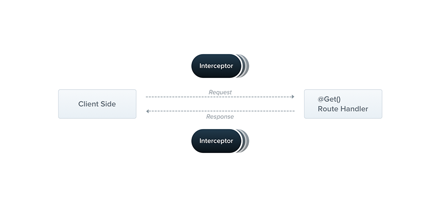

# Interceptors

## Giới thiệu về Interceptors

:::info

Trong NestJS, interceptors (bộ chặn) là một công cụ được sử dụng để can thiệp vào quá trình xử lý yêu cầu và phản hồi trong ứng dụng. Chúng có thể được sử dụng để thực hiện một loạt các tác vụ, chẳng hạn như:

1. **Logging (Ghi nhật ký)** : Interceptors có thể được sử dụng để ghi lại thông tin về yêu cầu và phản hồi, bao gồm thời gian xử lý, dữ liệu yêu cầu và dữ liệu phản hồi.
2. **Transformation (Chuyển đổi)** : Chúng có thể được sử dụng để chuyển đổi dữ liệu từ định dạng này sang định dạng khác trước khi trả về cho client. Điều này có thể bao gồm việc chuyển đổi định dạng JSON hoặc cấu trúc dữ liệu khác.
3. **Error Handling (Xử lý lỗi)** : Interceptors có thể bắt và xử lý lỗi xảy ra trong quá trình xử lý yêu cầu và trả về phản hồi lỗi phù hợp cho client.
4. **Caching (Bộ nhớ đệm)** : Chúng có thể được sử dụng để lưu trữ tạm thời kết quả của các yêu cầu để giảm tải cho hệ thống và cải thiện hiệu suất.
5. **Authentication và Authorization (Xác thực và Phân quyền)** : Interceptors có thể kiểm tra thông tin xác thực của yêu cầu và quyết định có nên tiếp tục xử lý yêu cầu hay không dựa trên quyền của người dùng.



:::

## Tạo Interceptors

- Một interceptor là một class được biểu thị bởi **@Injectable** (cho NestJS biết là chúng được quản lý bởi Dependency Injection container) và implements **NestInterceptor** interface.
- Interface **NestInterceptor< T, R >** là một generic, trong đó:
  - **T**: kiểu của dữ liệu trả về trước khi vào interceptor
  - **R**: kiểu dữ liệu sẽ trả về cho client sau khi được biến đổi bởi interceptor.

```ts
import {
  Injectable,
  NestInterceptor,
  ExecutionContext,
  CallHandler,
} from "@nestjs/common";
import { Observable } from "rxjs";
import { tap } from "rxjs/operators";

@Injectable()
export class LoggingInterceptor implements NestInterceptor {
  intercept(context: ExecutionContext, next: CallHandler): Observable<any> {
    console.log("Before...");

    const now = Date.now();
    return next
      .handle()
      .pipe(tap(() => console.log(`After... ${Date.now() - now}ms`)));
  }
}
```

- Phương thức **intercept** trong NestJS nhận vào hai tham số chính:

1. **context: [ExecutionContext](./execution-context#executioncontext-class)**
2. **next: CallHandler**: CallHandler đại diện cho luồng thực thi tiếp theo trong pipeline của NestJS. Nó có một phương thức chính là **handle()**, trả về một **Observable** có thể được sử dụng để can thiệp vào luồng dữ liệu của phản hồi. Bạn có thể sử dụng các toán tử của RxJS để xử lý hoặc biến đổi dữ liệu trước khi trả về cho client.

:::note

- Đoạn code logic trước return sẽ được chạy trước khi request được gửi đến route handler. Ở đây ta có thể biến đổi thông số request object thông qua tham số **context**.
- Đoạn code **next.handle().pipe()** sẽ được chạy trước khi gửi response về cho client. Ở đây ta có thể transform response, error,...
- Một số toán tử do RxJS cung cấp như:
  - **tap**: dùng để ghi nhật ký request.
  - **map**: biến đổi response data.
  - **catchError**: biển đổi error khi bị throw ra exception.
- **Interceptor** cũng giống như guard, controller,... đều có thể **inject dependencies** thông qua constructor().

:::

## Apply interceptor

- Tương tự như guard, interceptor có thể apply ở 3 mức độ: Global, Controller, Method.

### Áp dụng ở Global

```ts
const app = await NestFactory.create(AppModule);
app.useGlobalInterceptors(new LoggingInterceptor());
```

- Hoặc ở file AppModule:

```ts
import { Module } from "@nestjs/common";
import { APP_INTERCEPTOR } from "@nestjs/core";

@Module({
  providers: [
    {
      provide: APP_INTERCEPTOR,
      useClass: LoggingInterceptor,
    },
  ],
})
export class AppModule {}
```

### Áp dụng ở Controller

```ts
@UseInterceptors(LoggingInterceptor)
export class CatsController {}
```

### Áp dụng ở Method

```ts
@Controller("customers")
export class CustomersController {
  constructor(private customerService: CustomersService) {}

  @Post("/create")
  @UseInterceptors(TransformInterceptor)
  createCustomer(
    @Body()
    body: CreateCustomerDto
  ) {
    return this.customerService.create(body);
  }
}
```

## Ví dụ về interceptor

### Ghi log

- Ví dụ về sử dụng **tap** của RxJS để ghi nhật ký:

```ts
import {
  CallHandler,
  ExecutionContext,
  Injectable,
  NestInterceptor,
} from "@nestjs/common";
import { Request, Response } from "express";
import { Observable, tap } from "rxjs";

@Injectable()
export class LoggerInterceptor implements NestInterceptor {
  intercept(context: ExecutionContext, next: CallHandler): Observable<any> {
    const request = context.switchToHttp().getRequest<Request>();
    const response = context.switchToHttp().getResponse<Response>();
    const handler = context.getHandler();
    const className = context.getClass().name;

    console.log(
      `Handling ${request.method} request to ${request.url} in ${className}.${handler.name}`
    );

    return next.handle().pipe(
      tap((data) => console.log(`Response sent: `, JSON.stringify(data))) // Chỉ in ra nếu request trả về response thành công
    );
  }
}
```

✏️Khi đó, log sẽ có dạng kiểu như sau:

```plaintext
Handling POST request to /api/v1/customers/create in CustomersController.createCustomer
Response sent:  {"name":"Nguyen Minh Chi","password":"12345678","email":"minhchico@gmail.com"}
```

### Response Mapping

```ts
import {
  CallHandler,
  ExecutionContext,
  Injectable,
  NestInterceptor,
} from "@nestjs/common";
import { Observable } from "rxjs";
import { map } from "rxjs/operators";

export interface Response<T> {
  data: T;
}

@Injectable()
export class TransformInterceptor<T>
  implements NestInterceptor<T, Response<T>>
{
  intercept(
    context: ExecutionContext,
    next: CallHandler<T>
  ): Observable<Response<T>> {
    return next
      .handle()
      .pipe(map((dataBeforeInterceptor) => ({ data: dataBeforeInterceptor })));
  }
}
```

✏️Khi đó, response sẽ có dạng như sau:

```json
{
  "data": {
    "name": "Nguyen Minh Chi",
    "password": "12345678",
    "email": "minhchicog@mail.com",
    "id": 20
  }
}
```

### Exception mapping

```ts
import {
  Injectable,
  NestInterceptor,
  ExecutionContext,
  BadGatewayException,
  CallHandler,
} from "@nestjs/common";
import { Observable, throwError } from "rxjs";
import { catchError } from "rxjs/operators";

@Injectable()
export class ErrorsInterceptor implements NestInterceptor {
  intercept(context: ExecutionContext, next: CallHandler): Observable<any> {
    return next
      .handle()
      .pipe(catchError((err) => throwError(() => new BadGatewayException())));
  }
}
```

✏️Khi đó, bất kỳ request nào mà throw ra exception thì exception đó luôn bị override bởi **BadGatewayException**

### Request timeout

- Ví dụ sau nếu gửi request mà không nhận lại được phản hồi sau 5s, sẽ throw ra **RequestTimeoutException**

```ts
import {
  Injectable,
  NestInterceptor,
  ExecutionContext,
  CallHandler,
  RequestTimeoutException,
} from "@nestjs/common";
import { Observable, throwError, TimeoutError } from "rxjs";
import { catchError, timeout } from "rxjs/operators";

@Injectable()
export class TimeoutInterceptor implements NestInterceptor {
  intercept(context: ExecutionContext, next: CallHandler): Observable<any> {
    return next.handle().pipe(
      timeout(5000),
      catchError((err) => {
        return throwError(() => new RequestTimeoutException(err.message));
      })
    );
  }
}
```
