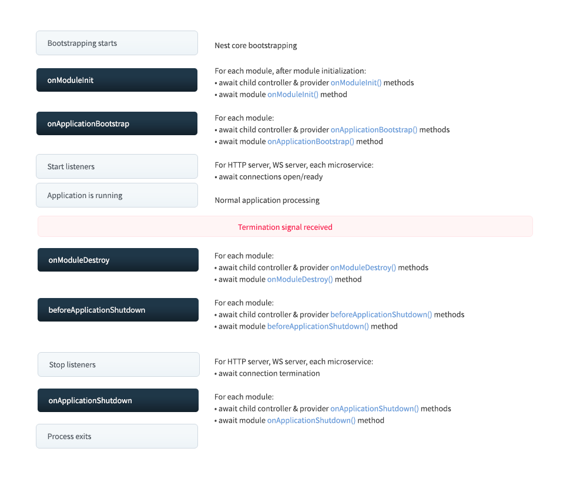

# Vòng đời của events

## Lifecycle trong NestJS

- NestJS cũng giống các ứng dụng khác, đều có vòng đời. NestJS cung cấp các lifecycle hooks cho chúng ta điều khiển các event trong vòng đời.
- Sơ đồ sau đây mô tả các chuỗi event quan trọng trong vòng đời của ứng dụng, từ khi ứng dụng được khởi động cho đến khi ứng dụng được ngắt.
- Ta có thể chia vòng đời tổng thể thành 3 giai đoạn: initializing (khởi tạo), running (chạy) và terminating (kết thúc). Sử dụng vòng đời này, ta có thể thực hiện lập kế hoạch khởi tạo module và các service một cách phù hợp, quản lý các kết nối đang hoạt động và ngắt ứng dụng một cách phù hợp.



| Lifecycle hook                | Mô tả                                                                                                                                                                                                                                       |
| ----------------------------- | ------------------------------------------------------------------------------------------------------------------------------------------------------------------------------------------------------------------------------------------- |
| `onModuleInit()`              | Được gọi MỘT LẦN sau khi một module được khởi tạo.                                                                                                                                                                                          |
| `onApplicationBootstrap()`    | Được gọi MỘT LẦN sau khi tất cả các module được khởi tạo xong và trước khi lắng nghe kết nối (**app.listen()**). Thường được sử dụng để thực hiện các tác vụ sau khi ứng dụng đã sẵn sàng, như đăng ký các lịch trình, khởi tạo cache, v.v. |
| `onModuleDestroy()`           | Được gọi khi một module sắp bị hủy. Thường được sử dụng để thực hiện các tác vụ dọn dẹp, như giải phóng tài nguyên, hủy đăng ký các dịch vụ, v.v.                                                                                           |
| `beforeApplicationShutdown()` | Được gọi sau khi**onModuleDestroy()** thực thi xong (bất kể là resolved hay rejected). Sau đó, tất cả các kết nối sẽ được đóng lại (**app.close()** được gọi)                                                                               |
| `onApplicationShutdown()`     | Được gọi sau khi tất cả kết nối được đóng (**app.close()** được resolved)                                                                                                                                                                   |

## Ví dụ

- Sau đây là một ví dụ với **onModuleInit()**:

```ts title="users.service.ts"
import { Injectable, OnModuleInit } from "@nestjs/common";

@Injectable()
export class UsersService implements OnModuleInit {
  onModuleInit() {
    console.log(`The module has been initialized.`);
  }
}
```

## Chú ý nhỏ

:::note

- Ta có ví dụ sau:

  - `PrismaService` có `onModuleInit()` được định nghĩa trong `PrismaModule`.
  - Ta import `PrismaModule` vào `AuthModule`.
  - Ta import `AuthModule` vào `AppModule`.

- Khi ứng dụng NestJS khởi động:

  1. `AppModule` được khởi tạo, và nó sẽ khởi tạo tất cả các module mà nó import, bao gồm `AuthModule`.
  2. Vì `AuthModule` import `PrismaModule`, nên `PrismaService` sẽ được khởi tạo.
  3. Sau khi `PrismaService` được khởi tạo, hàm `onModuleInit` của nó sẽ được gọi.

- Như vậy, hàm `onModuleInit` trong `PrismaService` sẽ được chạy, dù ta không trực tiếp import `PrismaModule` vào `AppModule`, mà chỉ thông qua việc import gián tiếp qua `AuthModule`. Nó cũng hoạt động tương tự như vậy khi ta import gián tiếp qua nhiều cấp độ.

- Trường hợp `PrismaModule` không được import vào bất cứ module nào ngoài `AppModule` mà ta muốn chạy hàm `onModuleInit()` thì lúc này ta phải import trực tiếp `PrismaModule` vào `AppModule`.

:::
