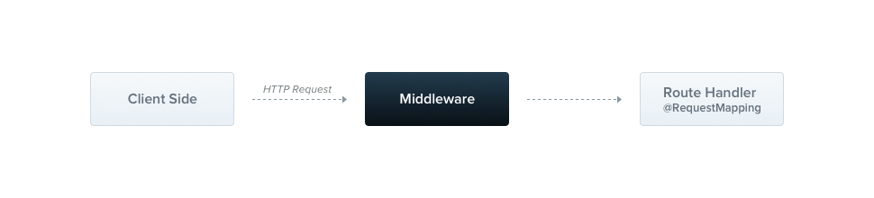

# Middleware

:::info

- Middleware là hàm mà sẽ được chạy trước khi vào router handler. Middleware có quyền truy cập vào đối tượng request và response, xử lý chúng.



:::

:::note

- Middleware có hỗ trợ Dependency Injection. Giống như provider hay controller, nó có thể inject các providers, service, dependencies ở trong hàm khởi tạo constructor()

:::

## Tạo middleware

```ts title="logger.middleware.ts"
import { Injectable, NestMiddleware } from "@nestjs/common";
import { Request, Response, NextFunction } from "express";

@Injectable()
export class LoggerMiddleware implements NestMiddleware {
  use(req: Request, res: Response, next: NextFunction) {
    console.log("Request...");
    next();
  }
}
```

## Apply middleware

- Ta apply middleware bên trong module như sau:

```ts title="app.module.ts"
import { Module, NestModule, MiddlewareConsumer } from "@nestjs/common";
import { LoggerMiddleware } from "./common/middleware/logger.middleware";
import { CatsModule } from "./cats/cats.module";

@Module({
  imports: [CatsModule],
})
export class AppModule implements NestModule {
  configure(consumer: MiddlewareConsumer) {
    consumer.apply(LoggerMiddleware).forRoutes("cats");
  }
}
```

```ts title="app.module.ts"
import { Module, NestModule, MiddlewareConsumer } from "@nestjs/common";
import { LoggerMiddleware } from "./common/middleware/logger.middleware";
import { CatsModule } from "./cats/cats.module";
import { CatsController } from "./cats/cats.controller";

@Module({
  imports: [CatsModule],
})
export class AppModule implements NestModule {
  configure(consumer: MiddlewareConsumer) {
    consumer.apply(LoggerMiddleware).forRoutes(CatsController);
  }
}
```

✏️Trong ví dụ thứ nhất bên trên, ta apply "LoggerMiddleware" cho tất cả những route bắt đầu bằng "/cats". Còn ở ví dụ thứ hai, ta apply middleware cho tất cả các route được định nghĩa ở trong "CatsController".

- Để apply middleware cho các route và với các method nhất định:

```ts title="app.module.ts"
import {
  Module,
  NestModule,
  RequestMethod,
  MiddlewareConsumer,
} from "@nestjs/common";
import { LoggerMiddleware } from "./common/middleware/logger.middleware";
import { CatsModule } from "./cats/cats.module";

@Module({
  imports: [CatsModule],
})
export class AppModule implements NestModule {
  configure(consumer: MiddlewareConsumer) {
    consumer
      .apply(LoggerMiddleware)
      .forRoutes({ path: "cats", method: RequestMethod.GET });
  }
}
```

- Ta cũng có thể exclude các route để không áp dụng middleware với các route này:

```ts
consumer
  .apply(LoggerMiddleware)
  .exclude(
    { path: "cats", method: RequestMethod.GET },
    { path: "cats", method: RequestMethod.POST }
  )
  .forRoutes(CatsController);
```

✏️Ở đây, ta áp dụng "LoggerMiddleware" đối với tất cả các route trong "CatsController" nhưng không áp dụng đối với method **GET** và **POST**.
