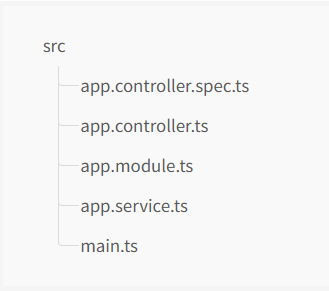

# Khởi tạo NestJS

- Trước khi khởi tạo project NestJS, ta sẽ cài đặt NestJS CLI:

```bash
npm i -g @nestjs/cli
```

- Sau đó, ta dùng lệnh sau để khởi tạo project:

```bash
nest new project-name
```

- Cấu trúc thư mục sau khi khởi tạo:



| Tên file               | Mô tả                                                                                          |
| ---------------------- | ---------------------------------------------------------------------------------------------- |
| app.controller.ts      | File controller định nghĩa các route                                                           |
| app.controller.spec.ts | File unit tests cho controller                                                                 |
| app.module.ts          | File module gốc của project                                                                    |
| app.service.ts         | File service của module app. Có nhiệm vụ tương tác với database, trả về dữ liệu cho controller |
| main.ts                | Entry file để chạy ứng dụng                                                                    |

## Thiết lập lại ESLint và Prettier

- Xem cách thiết lập: [tại đây](https://nmc-docs.github.io/eslint-prettier/setting/nestjs-setup).

## Câu lệnh chạy

- Chạy ở môi trường dev:

```bash
npm run start:dev
```

- Câu lệnh chạy ESLint + Prettier:

```bash
npm run lint
npm run format
```
