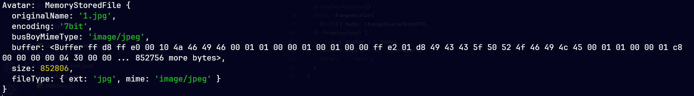

# Upload và validate file

## Cài đặt thư viện

```bash
npm install nestjs-form-data
```

## Cấu hình

- File **app-validation-pipe.ts**:

```ts title="app-validation-pipe.ts"
import { Injectable, ValidationPipe } from "@nestjs/common";

@Injectable()
export class AppValidationPipe extends ValidationPipe {
  constructor() {
    super({
      whitelist: true,
      transform: true,
    });
  }
}
```

## Tạo DTO

- Ta tạo DTO và sử dụng các decorator do thư viện cung cấp để validate file:

```ts title="change-avatar-body.dto.ts"
import { ApiProperty } from "@nestjs/swagger";
import { IsNotEmpty } from "class-validator";
import {
  HasMimeType,
  IsFile,
  MaxFileSize,
  MemoryStoredFile,
} from "nestjs-form-data";

import { MAX_AVATAR_FILE_SIZE } from "src/common/constants/file.constant";

export class ChangeAvatarBodyDTO {
  @ApiProperty({ type: "string", format: "binary" })
  @IsNotEmpty()
  @IsFile({ message: "Avatar must be a file" })
  @HasMimeType(["image/*"], { message: "Avatar must be an image" })
  @MaxFileSize(MAX_AVATAR_FILE_SIZE, {
    message: "File size must be lower than 5MB",
  })
  avatar: MemoryStoredFile;
}
```

## Tạo controller

- Ta sử dụng decorator **@FormDataRequest()** để có thể lấy được các giá trị từ form data từ body request:

```ts title="user.controller.ts"
import { FormDataRequest } from "nestjs-form-data";

@Controller("user")
export class UserController {
  @Put("change-avatar")
  @FormDataRequest()
  async changeAvatar(@Body() body: ChangeAvatarBodyDTO): Promise<any> {
    const { avatar } = body;
    console.log("Avatar: ", avatar);
    return "Done";
  }
}
```

## Tạo Module

```ts title="user.module.ts"
import { NestjsFormDataModule } from "nestjs-form-data";

import { UserController } from "src/modules/apis/user/user.controller";
import { UserService } from "src/modules/apis/user/user.service";

@Module({
  imports: [NestjsFormDataModule],
  controllers: [UserController],
  providers: [UserService],
})
export class UserModule {}
```

## Kết quả

- Sau khi upload file, avatar sẽ là một object có dạng như sau:



- Sau đó ta có thể sử dụng thư viện **cloudinary** để upload lên cloud và lấy URL của file về.
